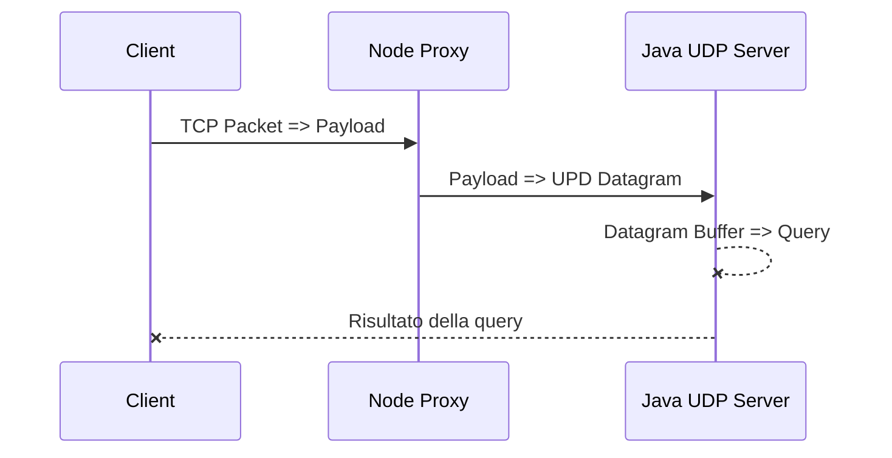
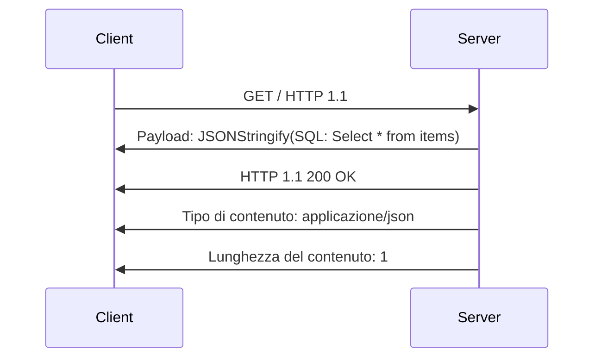
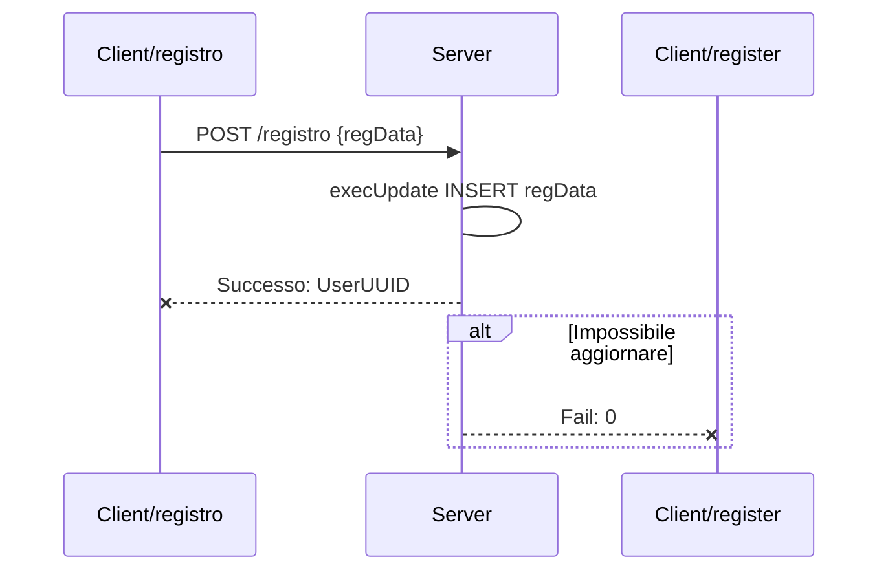


# Esempi di richieste al backend

### Mandare un Datagramma UDP alla Backend 

```mermaid

sequenceDiagram

Client ->> Node Proxy: TCP Packet => Payload

Node Proxy ->>Java UDP Server: Payload => UPD Datagram

Java UDP Server --x Java UDP Server: Datagram Buffer => Query

Java UDP Server--x Client: Risultato della query

```

### Invio di un pacchetto TCP al backend

```mermaid

sequenceDiagram

Client ->> Server: GET / HTTP 1.1

Server ->> Client: Payload: JSONStringify(SQL: Select * from items)

Server ->> Client: HTTP 1.1 200 OK

Server ->> Client: Tipo di contenuto: applicazione/json

Server ->> Client: Lunghezza del contenuto: 1

```

### Registrazione di un nuovo utente

```mermaid

sequenceDiagram

Client/registro ->> Server: POST /registro {regData}

Server -> Server: execUpdate INSERT regData

Server --x Client/registro: Successo: UserUUID
alt Impossibile aggiornare
	Server --x Client/register: Fail: 0
end
```