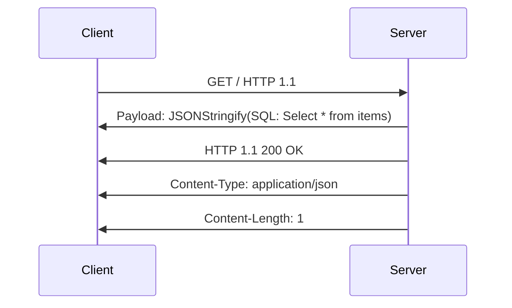
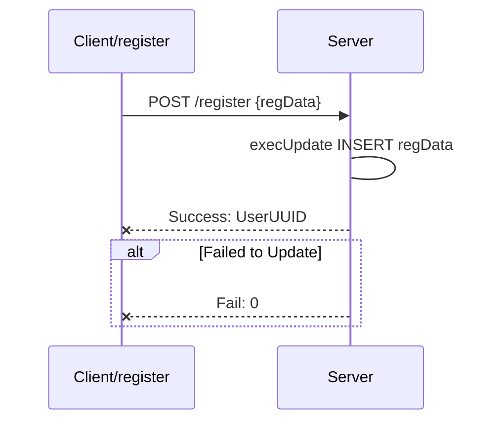

# Examples of Requests to the Backend

### Mandare un Datagramma UDP alla Backend 

```mermaid

sequenceDiagram

Client ->> Node Proxy: TCP Packet => Payload

Node Proxy ->>Java UDP Server: Payload => UPD Datagram

Java UDP Server --x Java UDP Server: Datagram Buffer => Query

Java UDP Server--x Client: Query Result

```

### Sending a TCP Packet to the Backend

```mermaid

sequenceDiagram

Client ->> Server: GET / HTTP 1.1

Server ->> Client: Payload: JSONStringify(SQL: Select * from items)

Server ->> Client: HTTP 1.1 200 OK

Server ->> Client: Content-Type: application/json

Server ->> Client: Content-Length: 1

```

### Registering a new User

```mermaid

sequenceDiagram

Client/register ->> Server: POST /register {regData}

Server -> Server: execUpdate INSERT regData

Server --x Client/register: Success: UserUUID
alt Failed to Update
	Server --x Client/register: Fail: 0
end 
```
  
