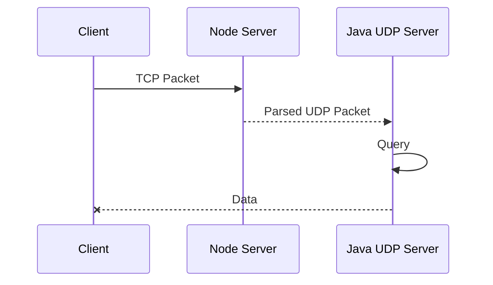
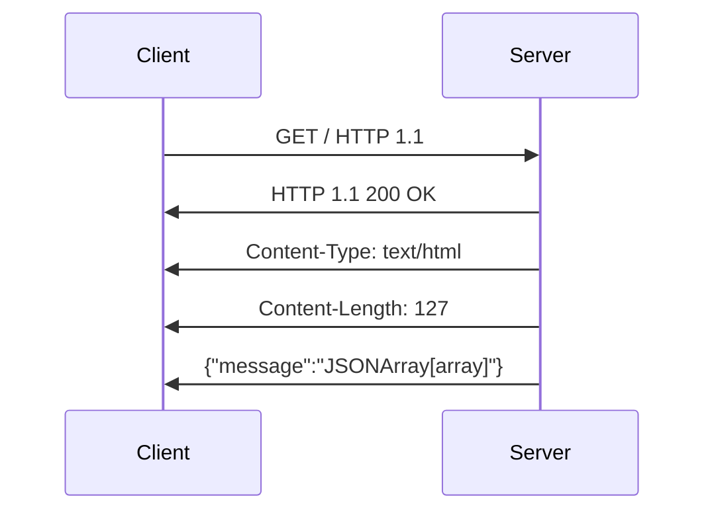

## Examples of Requests to the Backend 

```mermaid
sequenceDiagram
Client ->> Node Server: TCP Packet
Node Server-->>Java UDP Server: Parsed UDP Packet
Java UDP Server ->> Java UDP Server: Query
Java UDP Server--x Client: Data
```

```mermaid
sequenceDiagram
Client ->> Server: GET / HTTP 1.1
Server ->> Client: HTTP 1.1 200 OK
Server ->> Client: Content-Type: text/html
Server ->> Client: Content-Length: 127
Server ->> Client: {"message":"JSONArray[array]"}
```